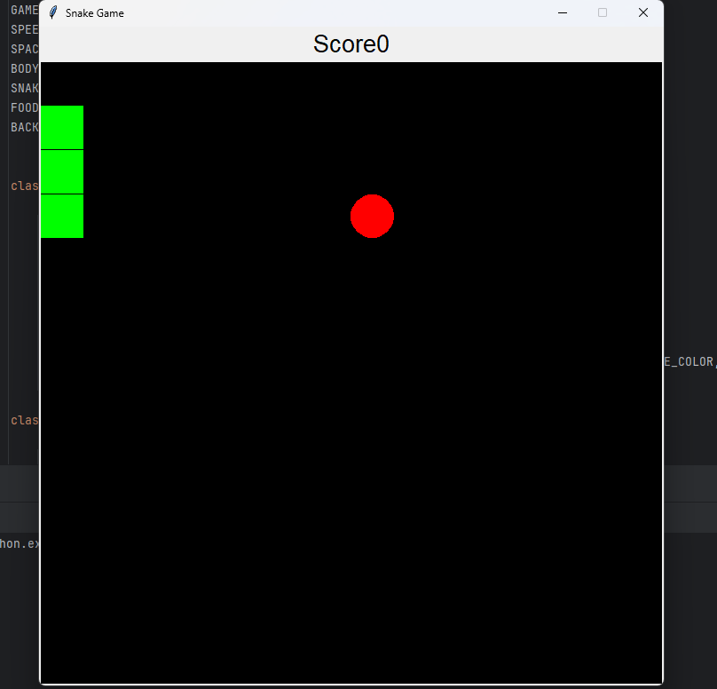
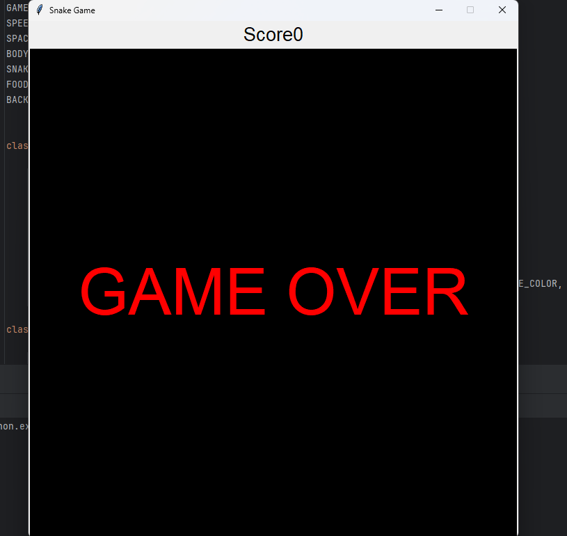

---

# Snake Senzia 🐍

**Snake Senzia** is a classic snake game built with Python using the Tkinter library for the graphical interface. In this game, the player controls a snake to eat food, growing longer with each meal, while avoiding collisions with the walls or the snake's own body. 

## Table of Contents
- [Features](#features)
- [Game Rules](#game-rules)
- [Installation](#installation)
- [How to Play](#how-to-play)
- [Controls](#controls)
- [Gameplay](#gameplay)
- [Contributing](#contributing)
- [License](#license)

## Features
- Classic snake gameplay with modern graphics.
- Real-time score tracking.
- Automatic game-over detection when the snake collides with the walls or itself.
- Responsive controls for seamless gameplay.
- Easy-to-use interface with basic Python dependencies.

## Game Rules
- Control the snake to eat the red food appearing on the screen.
- Each time the snake eats, it grows in length.
- Avoid crashing into the walls or the snake's own body.
- The game ends if the snake collides with itself or the boundaries of the screen.

## Installation

1. Clone the repository:
   ```bash
   git clone https://github.com/ChathuminiBandara/SnakeSenzia.git
   ```

2. Navigate to the project directory:
   ```bash
   cd SnakeSenzia
   ```

3. Install required dependencies (Tkinter is typically pre-installed with Python):
   ```bash
   pip install tkinter
   ```

4. Run the game:
   ```bash
   python SnakeSenzia.py
   ```

## How to Play
- Launch the game and control the snake using arrow keys.
- Move the snake to consume food while avoiding obstacles.
- The score increases with each food consumed.
- Survive as long as possible to achieve a high score!

## Controls
- **Up Arrow**: Move up
- **Down Arrow**: Move down
- **Left Arrow**: Move left
- **Right Arrow**: Move right

## Gameplay




As the game progresses, the snake grows longer, and it becomes more challenging to avoid collisions. The game ends when you hit a wall or your own body, displaying the "GAME OVER" screen.

## Contributing
Feel free to contribute to **Snake Senzia**! You can fork this repository, make your changes, and submit a pull request. Contributions are welcome!

## License
This project is licensed under the MIT License - see the [LICENSE](Licence.txt) file for details.

---
